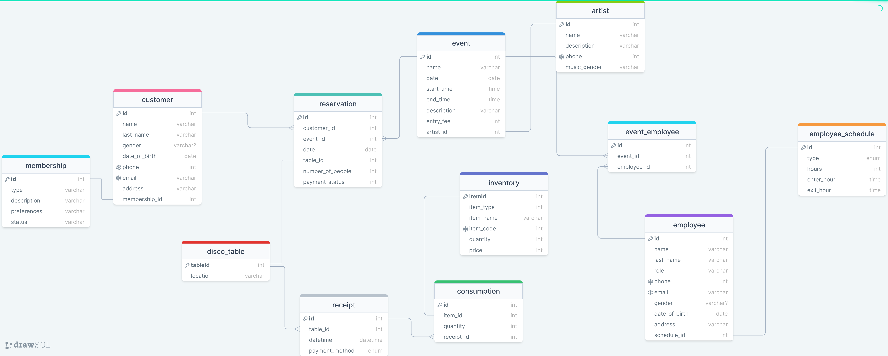

# Best night club in the city


### Requirements
## Conceptual Model:

As the client, running a nightclub business, I have specific needs for the database to ensure smooth operations and efficient management. Here are some key elements and functionalities that I require:

    Customer Management:
        Store customer details, including names, contact information, and membership status.
        Track customer preferences depending on their membership.

    Employee Management:
        Maintain a staff database with details like names, roles, contact information, and work schedules.

    Inventory Management:
        Keep track of bar inventory, including types and quantities of beverages and other supplies.

    Event Management:
        Schedule and manage events, parties, and promotions.

    Reservation System:
        Implement a reservation system for VIP tables or special events.
        Record customer preferences for seating arrangements.

    Financial Management:
        Record and track all financial transactions, including income and expenses.
        Generate financial reports for analysis and decision-making.

    Artist, Music and Entertainment:
        Keep track of music playlists and DJ schedules.

By addressing these specific aspects, the database would help streamline operations, enhance customer experience, and provide valuable insights for business growth and development.

## Logical Model:

Tables

The database consists of the following tables:

- employee_schedule: This table stores information about employee schedules, including the type of schedule (full-time or part-time), the number of hours worked per week, and the enter and exit hours.

- disco_table: This table stores information about the nightclub's tables, including the table ID and its location.

- reservation: This table stores information about reservations, including the customer ID, event ID, date, table ID, number of people, and payment status.

- event: This table stores information about events, including the event name, date, start time, end time, description, entry fee, and artist ID.

- consumption: This table stores information about consumption, including the item ID, quantity, and receipt ID.

- artist: This table stores information about the nightclub's artists, including the artist ID, name, description, phone number, and music genre.

- membership: This table stores information about the nightclub's memberships, including the membership ID, type, description, preferences, and status.

- event_employee: This table stores information about which employees are assigned to which events.

- receipt: This table stores information about receipts, including the receipt ID, table ID, date and time, and payment method.

- employee: This table stores information about the nightclub's employees, including the employee ID, name, last name, role, phone number, email address, gender (optional), date of birth, address, and schedule ID.

- customer: This table stores information about the nightclub's customers, including the customer ID, name, last name, gender (optional), date of birth, phone number, email address, address, and membership ID.

- inventory: This table stores information about the nightclub's inventory, including the item ID, item name, item type, item code, quantity, and price.


Relationships

The tables are related to each other in the following ways:

> The `event_employee` table has a foreign key constraint that references the `event table`. This means that each record in the `event_employee` table must have a corresponding record in the `event table` with the same event ID.
It also has a foreign key constraint that references the `employee` table.

> The `consumption` table has a foreign key constraint that references the `receipt` table and a foreign key constraint that references the `inventory` table.

> The `event` table has a foreign key constraint that references the `artist` table.

> The `employee` table has a foreign key constraint that references the `employee_schedule` table.

> The `reservation` table has a foreign key constraint that references the `event` table, it also has a foreign key constraint that references the `disco_table` table and a foreign key constraint that references the `customer` table.

> The `receipt` table has a foreign key constraint that references the `disco_table` table.

> The `customer` table has a foreign key constraint that references the `membership` table.

### Resume
    Primary Entities:
        Customer:
            Attributes: CustomerID (Primary Key), Name, ContactInfo, MembershipStatus.
        Employee:
            Attributes: EmployeeID (Primary Key), Name, ContactInfo, Role, Schedule.
        InventoryItem:
            Attributes: ItemID (Primary Key), ItemName, ItemType, Quantity, Cost.
        Event:
            Attributes: EventID (Primary Key), Name, Date, Type.
        Artist:
            Attributes: ArtistID (Primary Key), Name, Phone, MusicGender.
        Reservation:
            Fields: ReservationID (Primary Key), CustomerID, TableNumber, Date.

## Relationships Resume
Reservation-Customer (One-to-Many):

    Relates Reservation with Customer for tracking preferences.
Inventory-Sale (One-to-One):

    Links InventoryItem with sales transactions.
Event-Employee (One-to-Many):

    Relates the Employees who will work in an Event.

### Possible Views
Views:

    Views for commonly used queries, e.g., top-selling items, popular events.

# Result
## Physic Model:



> database schema for managing a disco. This schema includes tables for employee schedules, disco tables, reservations, events, consumables, artists, memberships, event employees, receipts, employees, customers, and inventory. Foreign key constraints have been defined to establish relationships between these tables.

# QUERIES

### artist
<details>
<summary>
CRUD QUERIES </summary>

CREATE (means adding or inserting rows into a table).
```sql
INSERT INTO artist (id, name, description, phone, music_gender) VALUES (1, 'Speaker Name', 'Keynote speaker', 987654321, 'Techno');
```
READ (means selecting rows from a table).
```sql
--all
SELECT * FROM artist;

--specific column
SELECT music_gender FROM artist;

--specific row
SELECT * FROM artist WHERE music_gender='techno';
```
UPDATE (means modifying rows in a table).
```sql
UPDATE artist SET music_gender = 'Reggaeton' WHERE id=1;
```
DELETE (means removing rows from a table).
```sql
DELETE FROM artist WHERE id=3;
```
</details>

### Queries for artist
1. Get artists with similar events to the reference artist:
```sql
DELIMITER $$
CREATE PROCEDURE getArtistsSimilarEvents(IN reference_artist_id INT)
BEGIN
    SELECT DISTINCT a.*
    FROM artist a
    JOIN event e1 ON a.id = e1.artist_id
    JOIN event e2 ON e1.id <> e2.id AND e1.description LIKE CONCAT('%', e2.description, '%');
    WHERE e2.artist_id = reference_artist_id;
END $$
DELIMITER ;


CALL getArtistsSimilarEvents(5);
```
2. Get artists with most sold tickets:
```sql
DELIMITER $$

CREATE PROCEDURE getArtistsMostSoldTickets()
BEGIN
    SELECT
        a.*, SUM(r.number_of_people) AS total_tickets_sold
    FROM
        artist a
    LEFT JOIN event e ON a.id = e.artist_id
    LEFT JOIN reservation r ON e.id = r.event_id
    GROUP BY a.id
    ORDER BY total_tickets_sold DESC;
END; $$
DELIMITER ;


CALL getArtistsMostSoldTickets();
```
3. Get Artists with High Entry Fees:
```sql
DELIMITER $$

CREATE PROCEDURE getArtistsHighEF(IN min_entry_fee INT)
BEGIN
    SELECT a.*, AVG(e.entry_fee) AS avg_entry_fee
    FROM artist a
    JOIN event e ON a.id = e.artist_id
    GROUP BY a.id
    HAVING avg_entry_fee > min_entry_fee;
END; $$
DELIMITER ;


CALL getArtistsHighEF(10);
```
4.
```sql
```
5.
```sql
```

### consumption
<details>
<summary>
CRUD QUERIES </summary>

CREATE (means adding or inserting rows into a table).
```sql
INSERT INTO consumption (id, item_id, quantity, receipt_id) VALUES (1, 1, 2, 1);
```
READ (means selecting rows from a table).
```sql
--all
SELECT * FROM consumption;

--specific row
SELECT * FROM consumption WHERE receipt_id=3;
```
UPDATE (means modifying rows in a table).
```sql
UPDATE consumption SET quantity=1000;
```
DELETE (means removing rows from a table).
```sql
DELETE FROM consumption WHERE receipt_id=3;
```
</details>

### Queries for consumption
1. Get items with increasing sales trend:
```sql
DELIMITER $$

CREATE PROCEDURE itemsIncreasingSales()
BEGIN
    SELECT itemId, item_name,
        (SELECT SUM(quantity) 
            FROM consumption c
            WHERE c.item_id = i.itemId
            AND DATE_SUB(CURDATE(), INTERVAL 3 MONTH) <= (SELECT MAX(datetime) 
            FROM receipt r 
            WHERE r.id = c.receipt_id)
        ) AS quantity_last_three_months
    FROM
        inventory i;
END; $$
DELIMITER ;


CALL itemsIncreasingSales();
```
2.
```sql
```
3.
```sql
```
4. Calculate Total Revenue from Consumables:
```sql
DELIMITER $$
CREATE PROCEDURE totalFromConsumables()
BEGIN
    DECLARE total_revenue INT;

    SELECT SUM(c.quantity * i.price) INTO total_revenue FROM consumption c
    JOIN inventory i ON c.item_id = i.itemId;

    SELECT total_revenue AS TotalRevenue;
END $$
DELIMITER ;


CALL totalFromConsumables();
```
5.
```sql
```

### customer
<details>
<summary>
CRUD QUERIES </summary>

CREATE (means adding or inserting rows into a table).
```sql
INSERT INTO customer (id, name, last_name, gender, date_of_birth, phone, email, address, membership_id) VALUES
(1, 'Olivia', 'Hernandez', 'Female', '1990-09-20', 555777888, 'olivia.hernandez@example.com', '456 Pine St', 4);
```
READ (means selecting rows from a table).
```sql
--all
SELECT * FROM customer;

--specific column
SELECT phone FROM customer;

--specific row
SELECT * FROM customer WHERE membership_id=3;
```
UPDATE (means modifying rows in a table).
```sql
UPDATE customer SET membership_id=1 WHERE id=4;
```
DELETE (means removing rows from a table).
```sql
DELETE FROM customer WHERE id=1;
```
</details>

### Queries for customer
1. Procedure to identify customers who have not made a purchase in a certain period:
```sql
DELIMITER $$

CREATE PROCEDURE identify_inactive_customers()
BEGIN
  DECLARE customer_id INT;
  DECLARE last_purchase_date DATE;

  SELECT customer.id AS customer_id, MAX(receipt.datetime) AS last_purchase_date
  FROM customer
  JOIN reservation ON customer.id = reservation.customer_id
  JOIN disco_table ON reservation.table_id = disco_table.tableId
  JOIN receipt ON disco_table.tableId = receipt.table_id
  GROUP BY customer.id
  HAVING last_purchase_date < NOW() - INTERVAL 6 MONTH;

  SET last_purchase_date = last_purchase_date;
END; $$
DELIMITER ;


CALL identify_inactive_customers();
```
2. Clients who have reserved on a Free Entry event just with the benefit of their membership:
```sql
DELIMITER //
CREATE PROCEDURE clientWithFreeReservation()
BEGIN
    SELECT c.*, m.type, r.date, e.name AS event_name
    FROM customer c
    JOIN membership m ON c.membership_id = m.id
    JOIN reservation r ON c.id = r.customer_id
    JOIN event e ON r.event_id = e.id
    WHERE e.entry_fee = 0 AND m.preferences like '%free entry%';
END //
DELIMITER ;


CALL clientWithFreeReservation();
```
3. Total revenue of client purchases:
```sql
DELIMITER //
CREATE PROCEDURE totalClientPurchase()
BEGIN
    SELECT c.*, SUM(i.price * co.quantity) AS total_spent
    FROM customer c
    JOIN reservation r ON c.id = r.customer_id
    JOIN receipt re ON r.id = re.id
    JOIN consumption co ON re.id = co.receipt_id
    JOIN inventory i ON co.item_id = i.itemId
    JOIN event e ON r.event_id = e.id
    WHERE e.artist_id IN (SELECT a.id FROM artist a JOIN event e ON a.id = e.artist_id)
    GROUP BY c.id;
END //
DELIMITER ;


CALL totalClientPurchase();
```
4. Clients who have been in events of the same artists more than once:
```sql
DELIMITER //
CREATE PROCEDURE clientWithEventOfCurrentArtists()
BEGIN
    SELECT c.*, e.name AS event_name, a.name AS artist_name
    FROM customer c
    JOIN reservation r ON c.id = r.customer_id
    JOIN event e ON r.event_id = e.id
    JOIN artist a ON e.artist_id = a.id
    WHERE a.id IN (
        SELECT artist_id
        FROM event
        GROUP BY artist_id
        HAVING COUNT(id) > 1
    );
END //
DELIMITER ;


CALL clientWithEventOfCurrentArtists();
```
5.
```sql
```

### disco_table
<details>
<summary>
CRUD QUERIES </summary>

CREATE (means adding or inserting rows into a table).
```sql
INSERT INTO `disco_table` (tableId, location) VALUES (1, 'Main Hall');
```
READ (means selecting rows from a table).
```sql
--all
SELECT * FROM disco_table;

--specific row
SELECT * FROM disco_table WHERE tableId=3;
```
UPDATE (means modifying rows in a table).
```sql
UPDATE disco_table SET location='Rooftop' WHERE tableId=2;
```
DELETE (means removing rows from a table).
```sql
DELETE FROM disco_table WHERE location='Rooftop';
```
</details>

### Queries for disco_table
1. Get Available Tables:
```sql
DELIMITER //
CREATE PROCEDURE GetAvailableTables()
BEGIN
    SELECT dt.*
    FROM disco_table dt
    LEFT JOIN reservation r ON dt.tableId = r.table_id
    WHERE r.table_id IS NULL OR r.date < CURDATE();
END //
DELIMITER ;


CALL GetAvailableTables();
```
2. Identify Popular Tables:
```sql
DELIMITER //
CREATE PROCEDURE identifyPopularTables()
BEGIN
    DECLARE done BOOLEAN DEFAULT FALSE;
    DECLARE tableId INT;
    DECLARE reservationCount INT;

    DECLARE popular_tables CURSOR FOR SELECT dt.tableId, COUNT(r.id) AS reservationCount
        FROM disco_table dt
        LEFT JOIN reservation r ON dt.tableId = r.table_id
        GROUP BY dt.tableId;

    DECLARE CONTINUE HANDLER FOR NOT FOUND SET done = TRUE;

    OPEN popular_tables;

    FETCH popular_tables INTO tableId, reservationCount;
    
    
    WHILE NOT done DO
        IF reservationCount > 5 THEN
			SELECT CONCAT('Table ID ', tableId, ' is popular with ', reservationCount, ' reservations.');
        END IF;

        FETCH popular_tables INTO tableId, reservationCount;
    END WHILE;
    
    CLOSE popular_tables;
END //
DELIMITER ;


CALL identifyPopularTables();
```
3. List tables located in the 'Rooftop' and their respective reservations:
```sql
SELECT d.tableId, d.location, r.id AS reservation_id, r.date, r.number_of_people
FROM disco_table d
JOIN reservation r ON d.tableId = r.table_id
WHERE d.location = 'Rooftop';
```
4. Find the table with the highest number of reservations in a specific month:
```sql
SELECT d.tableId, d.location, COUNT(r.id) AS reservation_count
FROM disco_table d
LEFT JOIN reservation r ON d.tableId = r.table_id
GROUP BY d.tableId, d.location
ORDER BY reservation_count DESC
LIMIT 1;
```
5. List the total number of people served on all tables in one event:
```sql
DELIMITER $$
CREATE PROCEDURE peopleServedInEvent(IN p_event_id INT)
BEGIN
    SELECT dt.tableId, SUM(r.number_of_people) AS totalPeopleServed
    FROM disco_table dt
    LEFT JOIN reservation r ON dt.tableId = r.table_id AND r.event_id = p_event_id
    GROUP BY dt.tableId;
END $$
DELIMITER ;


CALL peopleServedInEvent(3);
```

### employee
<details>
<summary>
CRUD QUERIES </summary>

CREATE (means adding or inserting rows into a table).
```sql
INSERT INTO employee (id, name, last_name, role, phone, email, gender, date_of_birth, address, schedule_id) VALUES
(1, 'Sophia', 'Martinez', 'Hostess', 555222111, 'sophia.martinez@example.com', 'Female', '1993-11-30', '789 Pine St', 2);
```
READ (means selecting rows from a table).
```sql
--all
SELECT * FROM employee;

--specific column
SELECT CONCAT(name, ' ', last_name) FROM employee;

--specific row
SELECT * FROM employee WHERE role='waitress';
```
UPDATE (means modifying rows in a table).
```sql
UPDATE employee SET role='Bartender' WHERE id=5;
```
DELETE (means removing rows from a table).
```sql
DELETE FROM employee WHERE id=4;
```
</details>

### Queries for employee
1. Which employees are near to their birthdays:
```sql
DELIMITER $$
CREATE PROCEDURE employeesBirthdayNextMonth(INOUT inmonth INT)
BEGIN
    SET p_month = MONTH(CURDATE()) + 1;
    SELECT employee.name FROM employee
    WHERE MONTH(date_of_birth) = inmonth;
END $$
DELIMITER ;


CALL employeesBirthdayNextMonth();
```
2. Calculate average age of employees by role:
```sql
DELIMITER $$
CREATE PROCEDURE averageAgeByRole(IN inrole VARCHAR(10), OUT average_age INT)
BEGIN
    SELECT AVG(YEAR(CURDATE()) - YEAR(date_of_birth)) INTO average_age
    FROM employee
    WHERE role = inrole;
END $$
DELIMITER ;


CALL averageAgeByRole(waiter);
```
3. Consumptions served and satisfied by employee:
```sql
DELIMITER $$
CREATE PROCEDURE employeeAttendConsumption()
BEGIN
    SELECT e.*, COUNT(co.id) AS consumptions_attended
    FROM employee e
    JOIN receipt re ON e.id = re.table_id
    JOIN consumption co ON re.id = co.receipt_id
    GROUP BY e.id;
END $$
DELIMITER ;


CALL employeeAttendConsumption();
```
4. Employees in service at the moment;
```sql
DELIMITER $$
CREATE PROCEDURE employeesInCurrentEvents()
BEGIN
    SELECT e.*, ev.name AS event_name, ev.date AS event_date
    FROM employee e
    JOIN event_employee ee ON e.id = ee.employee_id
    JOIN event ev ON ee.event_id = ev.id
    WHERE CURDATE() BETWEEN ev.date AND ev.end_time;
END $$
DELIMITER ;


CALL employeesInCurrentEvents();
```
5. Get employees by Role and Gender:
```sql
DELIMITER $$
CREATE PROCEDURE getEmployeesByRoleAndGender(IN p_role VARCHAR(10), IN p_gender VARCHAR(10))
BEGIN
    SELECT *
    FROM employee
    WHERE role = p_role AND gender = p_gender;
END $$
DELIMITER ;


CALL getEmployeesByRoleAndGender('Chef', 'Male');
```

### employee_schedule
<details>
<summary>
CRUD QUERIES </summary>

CREATE (means adding or inserting rows into a table).
```sql
INSERT INTO employee_schedule (id, type, hours, enter_hour, exit_hour) VALUES (1, 'full-time', 9, '17:00:00', '02:00:00');
```
READ (means selecting rows from a table).
```sql
--all
SELECT * FROM employee_schedule;

--specific column
SELECT type FROM employee_schedule;

--specific row
SELECT * FROM employee_schedule WHERE hours>4;
```
UPDATE (means modifying rows in a table).
```sql
UPDATE employee_schedule SET type='Fulltime';
```
DELETE (means removing rows from a table).
```sql
DELETE FROM employee_schedule WHERE type='part time';
```
</details>

### Queries for employee_schedule
1. Procedure to calculate the total number of hours worked by each employee:
```sql
-- Procedimiento para calcular el total de horas trabajadas por cada empleado sin cursor
DELIMITER //
CREATE PROCEDURE CalcularTotalHorasTrabajadasSinCursor()
BEGIN
    -- Temporalmente desactiva el límite de tiempo para la ejecución del procedimiento
    SET max_sp_recursion_depth = 1000;

    -- Crea la tabla temporal para almacenar los resultados intermedios
    CREATE TEMPORARY TABLE IF NOT EXISTS temp_total_hours (
        employee_id INT,
        total_hours INT
    );

    -- Inserta los resultados directamente utilizando una consulta
    INSERT INTO temp_total_hours (employee_id, total_hours)
    SELECT e.id AS employee_id, COALESCE(SUM(es.hours), 0) AS total_hours
    FROM employee e
    LEFT JOIN employee_schedule es ON e.schedule_id = es.id
    GROUP BY e.id;

    -- Muestra el resultado
    SELECT * FROM temp_total_hours;

    -- Elimina la tabla temporal
    DROP TEMPORARY TABLE IF EXISTS temp_total_hours;
END //
DELIMITER ;

```
2.
```sql
DELIMITER //
CREATE PROCEDURE ObtenerHorariosDetallesEventosAsociados()
BEGIN
    SELECT es.*, ev.name AS event_name, ev.date AS event_date
    FROM employee_schedule es
    JOIN event_employee ee ON es.id = ee.event_id
    JOIN event ev ON ee.event_id = ev.id;
END //
DELIMITER ;
```
3. Procedure to identify employees who are eligible for overtime pay:
```sql
-- Procedimiento para identificar empleados elegibles para pago de horas extras
DELIMITER //
CREATE PROCEDURE IdentificarEmpleadosHorasExtras()
BEGIN
    -- Temporalmente desactiva el límite de tiempo para la ejecución del procedimiento
    SET max_sp_recursion_depth = 1000;

    -- Crea la tabla temporal para almacenar los resultados intermedios
    CREATE TEMPORARY TABLE IF NOT EXISTS temp_overtime_eligible (
        employee_id INT,
        total_hours_worked INT
    );

    -- Inserta los resultados directamente utilizando una consulta
    INSERT INTO temp_overtime_eligible (employee_id, total_hours_worked)
    SELECT e.id AS employee_id, COALESCE(SUM(es.hours), 0) AS total_hours_worked
    FROM employee e
    LEFT JOIN employee_schedule es ON e.schedule_id = es.id
    GROUP BY e.id;

    -- Muestra el resultado
    SELECT * FROM temp_overtime_eligible WHERE total_hours_worked > 40;

    -- Elimina la tabla temporal
    DROP TEMPORARY TABLE IF EXISTS temp_overtime_eligible;
END //
DELIMITER ;

```
4.
```sql
DELIMITER //
CREATE PROCEDURE ObtenerHorariosEmpleadosPorTarifaEntrada(
    IN p_entry_fee INT
)
BEGIN
    SELECT es.*, e.name AS employee_name
    FROM employee_schedule es
    JOIN employee e ON es.id = e.schedule_id
    WHERE es.id IN (
        SELECT DISTINCT es.id
        FROM employee_schedule es
        JOIN employee e ON es.id = e.schedule_id
        JOIN event_employee ee ON e.id = ee.employee_id
        JOIN event ev ON ee.event_id = ev.id
        WHERE ev.entry_fee = p_entry_fee
    );
END //
DELIMITER ;
```
5. Procedure to calculate the average working hours per employee type:
```sql
-- Procedimiento para calcular el promedio de horas de trabajo por tipo de empleado
DELIMITER //
CREATE PROCEDURE CalcularPromedioHorasPorTipoEmpleado()
BEGIN

    -- Muestra el resultado del promedio de horas por tipo de empleado
    SELECT e.role AS employee_type, AVG(es.hours) AS average_hours
    FROM employee e
    LEFT JOIN employee_schedule es ON e.schedule_id = es.id
    GROUP BY e.role;
END //
DELIMITER ;

```

### event
<details>
<summary>
CRUD QUERIES </summary>

CREATE (means adding or inserting rows into a table).
```sql
INSERT INTO event (id, name, date, start_time, end_time, description, entry_fee, artist_id) VALUES
(1, 'Concert', '2023-12-01', '19:00:00', '24:00:00', 'Live music event', 20, 1);
```
READ (means selecting rows from a table).
```sql
--all
SELECT * FROM event;

--specific column
SELECT date FROM event;

--specific row
SELECT * FROM event WHERE date='2023-12-01';
```
UPDATE (means modifying rows in a table).
```sql
UPDATE event SET name='Christmas Party' WHERE id=5;
```
DELETE (means removing rows from a table).
```sql
DELETE FROM event WHERE id=1;
```
</details>

### Queries for event
1. Query within a procedure to find events with reservations made by customers under the age of 25:
```sql
DELIMITER //
CREATE PROCEDURE EncontrarEventosReservasMenoresDe25()
BEGIN
    SELECT e.*
    FROM event e
    JOIN reservation r ON e.id = r.event_id
    JOIN customer c ON r.customer_id = c.id
    WHERE TIMESTAMPDIFF(YEAR, c.date_of_birth, CURDATE()) < 25;
END //
DELIMITER ;
```
2. Query within a procedure to find events with the highest average entry fee:
```sql
DELIMITER //
CREATE PROCEDURE EncontrarEventosMayorTarifaPromedio()
BEGIN
    SELECT e.*, AVG(r.entry_fee) AS average_entry_fee
    FROM event e
    LEFT JOIN reservation r ON e.id = r.event_id
    GROUP BY e.id
    ORDER BY average_entry_fee DESC
    LIMIT 5;
END //
DELIMITER ;
```
3. Query within a procedure to find events with reservations from customers who have a 'Premium' membership:
```sql
DELIMITER //
CREATE PROCEDURE EncontrarEventosReservasClientesPremium()
BEGIN
    SELECT e.*
    FROM event e
    JOIN reservation r ON e.id = r.event_id
    JOIN customer c ON r.customer_id = c.id
    JOIN membership m ON c.membership_id = m.id
    WHERE m.type = 'Premium';
END //
DELIMITER ;
```
4. Query within a procedure to find events with the highest total revenue, considering both entry fees and consumption:
```sql
DELIMITER //
CREATE PROCEDURE EncontrarEventosMayorFacturacionTotal()
BEGIN
    SELECT e.*, (SUM(r.number_of_people * e.entry_fee) + COALESCE(SUM(c.quantity * i.price), 0)) AS total_revenue
    FROM event e
    LEFT JOIN reservation r ON e.id = r.event_id
    LEFT JOIN receipt rc ON r.id = rc.id
    LEFT JOIN consumption c ON rc.id = c.receipt_id
    LEFT JOIN inventory i ON c.item_id = i.itemId
    GROUP BY e.id
    ORDER BY total_revenue DESC
    LIMIT 5;
END //
DELIMITER ;
```
5.
```sql
```

### event_employee
<details>
<summary>
CRUD QUERIES </summary>

CREATE (means adding or inserting rows into a table).
```sql
INSERT INTO event_employee (id, event_id, employee_id) VALUES (1, 1, 1);
```
READ (means selecting rows from a table).
```sql
--all
SELECT * FROM event_employee;

--specific row
SELECT * FROM event_employee WHERE event_id=3;
```
UPDATE (means modifying rows in a table).
```sql
UPDATE event_employee SET event_id=1 WHERE employee_id=5;
```
DELETE (means removing rows from a table).
```sql
DELETE FROM event_employee WHERE id=3;
```
</details>

### Queries for event_employee
1.
```sql
```
2.
```sql
```
3.
```sql
```
4.
```sql
```
5.
```sql
```

### inventory
<details>
<summary>
CRUD QUERIES </summary>

CREATE (means adding or inserting rows into a table).
```sql
INSERT INTO inventory (itemId, item_name, item_type, item_code, quantity, price) VALUES (1, 'Vodka', 'Drinks', 1111, 80, 50);
```
READ (means selecting rows from a table).
```sql
--all
SELECT * FROM inventory;

--specific column
SELECT item_name FROM inventory;

--specific row
SELECT * FROM inventory WHERE quantity<10;
```
UPDATE (means modifying rows in a table).
```sql
UPDATE inventory SET quantity=1000;
```
DELETE (means removing rows from a table).
```sql
DELETE FROM inventory WHERE itemId=2;
```
</details>

### Queries for inventory
1.
```sql
```
2.
```sql
```
3.
```sql
```
4. Procedure to update the stock level for an item:
```sql
DELIMITER $$

CREATE PROCEDURE update_stock_level(IN item_id INT, IN quantity_change INT)
BEGIN
  DECLARE new_stock INT;

  SELECT quantity INTO new_stock
  FROM inventory
  WHERE item_id = item_id;

  IF NOT FOUND THEN
    SIGNAL SQLSTATE '45000' SET MESSAGE_TEXT = 'Item not found in inventory';
  END IF;

  UPDATE inventory
  SET quantity = new_stock + quantity_change
  WHERE item_id = item_id;
END; $$
DELIMITER ;

```
5.
```sql
```

### membership
<details>
<summary>
CRUD QUERIES </summary>

CREATE (means adding or inserting rows into a table).
```sql
INSERT INTO membership (id, type, description, preferences, status) VALUES (1, 'Premium', 'Premium membership', 'VIP access', 'Active');
```
READ (means selecting rows from a table).
```sql
--all
SELECT * FROM membership;

--specific column
SELECT type, preferences FROM membership;

--specific row
SELECT * FROM membership WHERE type='premium';
```
UPDATE (means modifying rows in a table).
```sql
UPDATE membership SET status = 'Nonactive';
```
DELETE (means removing rows from a table).
```sql
DELETE FROM membership WHERE id=2;
```
</details>

### Queries for membership
1. Get members with specific preferences:
```sql
DELIMITER $$

CREATE PROCEDURE getMembersWithPreferences(IN preferred_features VARCHAR(50))
BEGIN
    SELECT *
    FROM membership
    WHERE preferences LIKE CONCAT('%', preferred_features, '%');
END; $$
DELIMITER ;

```
2. Procedure to identify memberships with a high likelihood of renewal:
-- membresia pronta a renovaciones de cliente 0 o 1
```sql
CREATE PROCEDURE identify_high_renewal_likelihood_memberships()
BEGIN
  DECLARE membership_id INT;
  DECLARE renewal_likelihood DECIMAL(10,2);

  SELECT membership.id AS membership_id,
         AVG(membership.renewal_history) AS renewal_likelihood
  FROM membership
  GROUP BY membership.id
  HAVING renewal_likelihood > 0.8;

  SET renewal_likelihood = renewal_likelihood;
END;

```
3.
```sql
```
4.
```sql
```
5.
```sql
```

### receipt
<details>
<summary>
CRUD QUERIES </summary>

CREATE (means adding or inserting rows into a table).
```sql
INSERT INTO receipt (id, table_id, datetime, payment_method) VALUES (1, 1, '2023-12-01 20:30:00', 'credit card');
```
READ (means selecting rows from a table).
```sql
--all
SELECT * FROM receipt;

--specific column
SELECT table_id, peyment_method FROM receipt;

--specific row
SELECT * FROM receipt WHERE table_id=3;
```
UPDATE (means modifying rows in a table).
```sql
UPDATE receipt SET payment_method='Cash';
```
DELETE (means removing rows from a table).
```sql
DELETE FROM receipt WHERE table_id=4;
```
</details>

### Queries for receipt
1. Procedure to identify customers who have exceeded a certain spending limit:
```sql
CREATE PROCEDURE high_spending_customers()
BEGIN
  DECLARE customer_id INT;
  DECLARE total_spent INT;
  DECLARE spending_limit INT;

  SELECT customer.id AS customer_id,
         SUM(receipt.total_amount) AS total_spent
  FROM receipt
  JOIN reservation ON receipt.reservation_id = reservation.id
  JOIN customer ON reservation.customer_id = customer.id
  GROUP BY customer.id
  HAVING total_spent > spending_limit;

  SET total_spent = total_spent;
END;


SET @spending_limit = 100;
CALL high_spending_customers();

```
2. Procedure to view the average receipt amount per customer type:
```sql
DELIMITER $$
CREATE PROCEDURE calculate_average_receipt_amount_per_customer_type_and_event_type()
BEGIN
  DECLARE customer_type ENUM('Premium','Basic','Gold','Silver');
  DECLARE event_type ENUM('Concert','Party','Comedy Show');
  DECLARE average_amount INT;

  SELECT membership.type AS customer_type,
         event.type AS event_type,
         AVG(receipt.total_amount) AS average_amount
  FROM receipt
  JOIN reservation ON receipt.reservation_id = reservation.id
  JOIN customer ON reservation.customer_id = customer.id
  JOIN membership ON customer.membership_id = membership.id
  JOIN event ON reservation.event_id = event.id
  GROUP BY membership.type, event.type;

  SET average_amount = average_amount;
END; $$
DELIMITER ;

```
3.
```sql
```
4.
```sql
```
5.  Procedure to identify receipts with a high likelihood of fraud:
```sql
CREATE PROCEDURE identify_fraudulent_receipts()
BEGIN
  DECLARE receipt_id INT;
  DECLARE fraud_likelihood DECIMAL(10,2);

  SELECT receipt.id AS receipt_id,
         AVG(receipt.item_quantity) AS average_item_quantity
  FROM receipt
  JOIN consumption ON receipt.id = consumption.receipt_id
  GROUP BY receipt.id
  HAVING average_item_quantity > 5;

  SET fraud_likelihood = fraud_likelihood;
END;

```

### reservation
<details>
<summary>
CRUD QUERIES </summary>

CREATE (means adding or inserting rows into a table).
```sql
INSERT INTO reservation (id, customer_id, event_id, date, table_id, number_of_people, payment_status) VALUES (1, 1, 1, '2023-12-01', 1, 4, 0);
```
READ (means selecting rows from a table).
```sql
--all
SELECT * FROM reservation;

--specific column
SELECT customer_id FROM reservation;

--specific row
SELECT * FROM reservation WHERE customer_id=3;
```
UPDATE (means modifying rows in a table).
```sql
UPDATE reservation SET payment_status=1;
```
DELETE (means removing rows from a table).
```sql
DELETE FROM reservation WHERE customer_id=2;
```
</details>

### Queries for reservation
1. Calculate Total Revenue for an Event:
```sql
```
2. Cancel Reservations with Unpaid Entry Fees:
```sql
```
3.  Procedure to generate a report on the average reservation amount per customer type:
```sql
DELIMITER $$

CREATE PROCEDURE averageReservationPerCustomerType()
BEGIN
  DECLARE customer_type ENUM('Premium','Basic','Gold','Silver');
  DECLARE average_amount INT;

  DECLARE average_reservation_cursor CURSOR FOR
    SELECT customer.type AS customer_type,
           AVG(receipt.total_amount) AS average_amount
    FROM reservation
    JOIN customer ON reservation.customer_id = customer.id
    JOIN receipt ON reservation.id = receipt.reservation_id
    GROUP BY customer.type;

  OPEN average_reservation_cursor;

  average_reservation_loop: LOOP
    FETCH average_reservation_cursor INTO customer_type, average_amount;

    IF NOT FOUND THEN
      LEAVE average_reservation_loop;
    END IF;

    UPDATE customer
    SET average_reservation_amount = average_amount
    WHERE type = customer_type;
  END LOOP;

  CLOSE average_reservation_cursor;
END; $$
DELIMITER ;

```
4.
```sql
```
5.
```sql
DELIMITER $$

CREATE PROCEDURE send_confirmation()
BEGIN
  DECLARE reservation_id INT;
  DECLARE customer_email VARCHAR(255);

  DECLARE new_reservation_cursor CURSOR FOR
    SELECT reservation.id AS reservation_id, customer.email AS customer_email
    FROM reservation
    JOIN customer ON reservation.customer_id = customer.id
    WHERE reservation.payment_status = 0;

  OPEN new_reservation_cursor;

  reservation_loop: LOOP
    FETCH new_reservation_cursor INTO reservation_id, customer_email;

    IF NOT FOUND THEN
      LEAVE reservation_loop;
    END IF;

    SET @email_subject = 'Your Reservation is Confirmed';
    SET @email_body = 'Dear Customer,

    Your reservation for Event has been confirmed.

    Sincerely,

    The Nightclub Team';

    UPDATE reservation
    SET payment_status = 1
    WHERE id = reservation_id;
  END LOOP;

  CLOSE new_reservation_cursor;
END; $$

DELIMITER ;

```